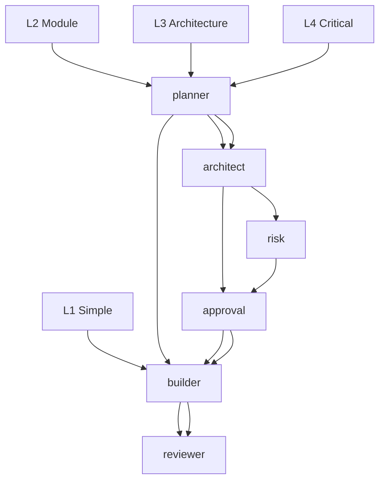

# Agents Documentation — EURINHASH

## Table of Contents
1. [eurinhash.md](#eurinhashmd)
2. [planner.md](#plannermd)
3. [architect.md](#architectmd)
4. [design-lead.md](#design-leadmd)
5. [builder.md](#buildermd)
6. [quality-engineer.md](#quality-engineermd)
7. [tester.md](#testermd)
8. [security.md](#securitymd)
9. [reviewer.md](#reviewermd)
10. [git-engineer.md](#git-engineermd)
11. [docwriter.md](#docwritermd)
12. [Workers (fallback)](#workers-fallback)
13. [Routing matrix (hash-agent-matrix)](#routing-matrix)

---

## 1. eurinhash.md — Supervisor

### Role
EURINHASH main supervisor. Manages provider rotation, quota tracking, circuit breaker, and decides which agent/provider to use based on task type.

### Model
- `groq/qwen/qwen3.8-27b` (via Groq API)

### EURINHASH Protocol (6 steps)

**Step 1 — Probe**: Read `free-models.json`. If >30min or file missing → run `python scripts/free-probe.py`.

**Step 2 — Pick**: Define fallback order:
- **Code task**: `groq → mistral → zhipu → openrouter → novita → together`
- **Chat task**: `groq → zhipu → mistral → openrouter → novita → together`
- **Other task**: Default order

**Step 3 — Delegate**: Send full task + context to the first available worker. Include:
- Full prompt
- Task type
- Target model
- Options (max_tokens, temperature)

**Step 4 — Rotate**: On 429/quota/auth/timeout:
- Mark provider KO in `provider_circuit.json`
- Move to next provider
- Retry with same prompt

**Step 5 — Stop**: If all providers KO:
- Summarize progress/blockage
- Propose paid fallback (Mammouth)
- Request explicit approval

**Step 6 — No Paid**: Never use paid model without explicit approval

### Invocation

```bash
# Via OpenCode TUI
/agent eurinhash "Manage my session"

# Via prompt
@eurinhash Manage my session: ...
```

### Decision Logic
```python
# Pseudocode
def select_provider(task_type):
    order = {
        "code": ["groq", "mistral", "zhipu", "openrouter", "novita", "together"],
        "chat": ["groq", "zhipu", "mistral", "openrouter", "novita", "together"],
    }.get(task_type, ["groq", "zhipu", "mistral", "openrouter", "novita", "together"])
    
    for provider in order:
        if load_key(provider) and check_circuit(provider) and check_quota(provider, model):
            return provider
    
    return None  # No provider available
```

---

## 2. planner.md — Planning

### Model
- `groq/qwen/qwen3.8-27b`

### Role
Plans complex tasks before execution. Decides scope, dependencies, and creates a structured plan.

### When to Invoke
- Task modifies 3+ files
- New feature with multiple dependencies
- Multi-module refactoring
- Architectural decision needed

### Plan Structure
```markdown
## Task Plan

### Objective
Describe what we want to achieve.

### Scope
- Files to modify: ...
- Files to create: ...
- Files to delete: ...

### Steps
1. First step: ...
2. Second step: ...
3. Third step: ...

### Dependencies
- Module A requires Module B
- Requires npm install before

### Risks
- Risk 1: ...
- Risk 2: ...

### Validation
- Success criteria: ...
- Tests to run: ...
```

### Invocation
```bash
/agent planner "Plan the auth module refactor"
```

---

## 3. architect.md — Architecture

### Model
- `groq/qwen/qwen3.8-27b`

### Role
Makes long-term architectural decisions. Weighs performance/maintainability, scalability, security trade-offs.

### Decision Areas
- Library/framework choices
- Architectural patterns (MVCC, CQRS, Event Sourcing)
- Horizontal vs vertical scaling
- Relational vs NoSQL database
- Microservices vs monolithic architecture

### When to Invoke
- New project or major new module
- Infrastructure migration
- Shifting from one architecture to another
- Persistent performance issues

### Invocation
```bash
/agent architect "Decide architecture for a task management SaaS"
```

---

## 4. design-lead.md — Design Lead

### Model
- `groq/qwen/qwen3.8-27b`

### Role
UI/UX direction. Defines visual style, interactions, design system consistency.

### Responsibilities
- Layout, hierarchy, spacing
- Typography, colors, components
- Responsive behavior, animations/micro-interactions
- Accessibility (WCAG), color contrast
- Tone and copy (agent doesn't write final copy)

### Areas
- Layout & spacing (grid, margin, padding)
- Typography (font, size, weight)
- Color system (palette, WCAG contrast)
- Components (buttons, forms, navigation)
- Interactions (hover, focus, animations)
- Responsive (breakpoints, mobile layout)
- Design tokens (centralized design tokens)

### When to Invoke
- New UI component
- Page redesign
- Accessibility issue
- Visual consistency restoration

### Invocation
```bash
/agent design-lead "Redesign login form with better UX and accessibility"
```

---

## 5. builder.md — Builder

### Model
- `mistral/codestral-latest` (via Mistral API)

### Role
Concrete code execution. Implements front-end and back-end features, creates components, modifies existing functionality.

### Strengths
- Rapid implementation of well-defined features
- Multi-file parallel execution
- Strict adherence to existing specs
- Design-to-code conversion

### Limitations
- Design taste (prefer @designer)
- Architectural decisions (prefer architect)
- Visual preferences (prefer design-lead)
- Understanding user intent (sometimes)

### When to Invoke
- Clear, bounded feature
- Precise, reproducible bug
- Structured data migration
- API porting

### When NOT to Invoke
- Need for design taste
- Architectural decisions
- Abstract problems
- Vague specifications

### Invocation
```bash
/builder "Implement getUser function with error handling"
# Or via prompt
@builder Implement getUser function with error handling
```

### Expected Code Structure
```typescript
/**
 * Function description
 * @param {Type} param - Description
 * @returns {Type} - Return description
 * @throws {Error} - Error conditions
 *
 * Example:
 * const result = getUser(123);
 * console.log(result); // { id: 123, name: "Jean" }
 */
function getUser(id: number): User {
  // implementation
}
```

---

## 6. quality-engineer.md — Quality Engineer

### Model
- `mistral/codestral-latest`

### Role
Code quality. Linting, formatting, anti-patterns, best practices.

### Tools
- Ruff (Python) / eslint (JS/TS)
- Prettier (formatting)
- SonarLint / CodeQL
- Unit tests

### Responsibilities
- `ruff --check` clean
- `ruff --fix` applied
- No bare `except`
- Type hints everywhere
- Parameterized SQL only
- Virtualenv per project

### When to Invoke
- Before each commit
- Pull request opening
- New code discovery
- Refactoring completion

### Invocation
```bash
/quality-engineer "Check this code quality"
# Or
@quality-engineer Analyze this file for anti-patterns
```

---

## 7. tester.md — Tester

### Model
- `mistral/codestral-latest`

### Role
Automated tests. Unit, integration, e2e tests.

### Responsibilities
- Coverage ≥ 80%
- No brittle tests
- Meaningful tests (not just "hello world")
- Test reliability

### When to Invoke
- New code added
- Bug fix
- Refactoring
- Before each release

### Invocation
```bash
/tester "Write tests for calculate_total function"
```

---

## 8. security.md — Security

### Model
- `mistral/codestral-latest`

### Role
Security analysis. OWASP Top 10, vulnerabilities, audit.

### Areas
- Injection (SQL, NoSQL, OS, Command injection)
- Authentication, Authorization
- Secrets, API keys in code
- XSS, CSRF
- Rate limiting
- Secret exposure
- Sensitive data handling

### When to Invoke
- Code handling sensitive data
- Authentication implemented
- Production deployment
- Vulnerability discovery

### Invocation
```bash
/security "Analyze security risks of this code"
```

---

## 9. reviewer.md — Reviewer

### Model
- `mistral/codestral-latest`

### Role
Code review. Architecture, quality, best practices, security.

### When to Invoke
- Pull request opening
- Peer code review
- New code discovery

### Invocation
```bash
/review "Review this PR: ..."
# Or
@reviewer Review this code
```

---

## 10. git-engineer.md — Git Engineer

### Model
- `mistral/codestral-latest`

### Role
Git operations. Commits, branches, merges, history.

### Responsibilities
- Conventional Commits
- Branch strategy (gitflow/maintenance)
- Merge conflict resolution
- Git history cleanup
- Release tagging

### When to Invoke
- New feature commit
- Branch creation/merging
- History cleanup
- Release tagging

### Invocation
```bash
/git-engineer "Commit refactor with conventional message"
```

---

## 11. docwriter.md — Doc Writer

### Model
- `groq/qwen/qwen3.8-27b`

### Role
Technical documentation. README, API docs, user guides.

### When to Invoke
- New project
- API changes
- User guide needed

### Invocation
```bash
/docwriter "Write README for this project"
```

---

## 12. Workers (fallback)

### worker-codestral.md
- `mistral/codestral-latest`
- Mistral fallback

### worker-google.md
- `google/gemini-2.5-flash`
- Google fallback

### worker-groq.md
- `groq/qwen/qwen3.8-27b`
- Groq fallback

### worker-zhipu.md
- `zhipu/glm-4.7-flash`
- Zhipu fallback (note: often returns 429)

---

## 13. Routing matrix (hash-agent-matrix)

### Levels
| Level | Description | Example | Pipeline |
|-------|-------------|---------|----------|
| **L1** | Typo, color, config, localized bug | "Fix typo 'teh' to 'the'", "Change color to #FF0000" | `@builder` (direct) |
| **L2** | Module, endpoint, business logic | "Add OAuth authentication", "Create user API" | `@planner` → `@builder` |
| **L3** | New module, architecture, API change | "Refactor to microservices", "New payment system" | `@planner` → `@architect` → `approval` → `@builder` → `@reviewer` |
| **L4** | Critical: production, sensitive data | "Migrate customer data to new DB", "Encrypt passwords" | `@planner` → `@architect` → `risk assessment` → `approval` → `@builder` → `@reviewer` |

### Pipeline by Level


### Automatic Routing
```bash
# L1: Direct to builder
opencode /run "Fix typo in button"

# L2: Planning first
/agent planner "Plan auth addition"
/agent builder "Implement auth"

# L3: Architecture + approval
/agent architect "Decide architecture"
# After approval:
/agent builder "Implement per approved architecture"

# L4: Architecture + risk + approval
/agent architect "Assess data migration risks"
# After risk assessment and approval:
/agent builder "Migrate data"
```

---

*Documentation agents generated $(date)*