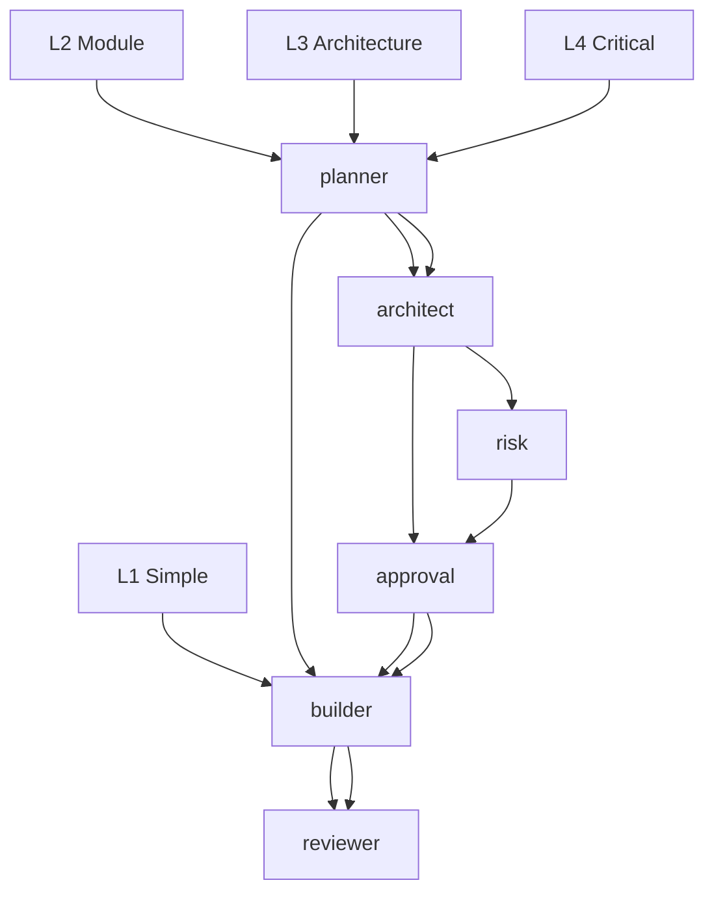
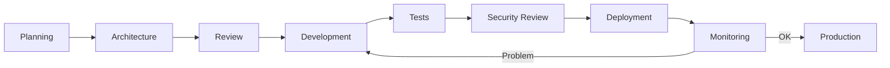

# Skills Documentation — opencode-config EURINHASH

## Table of Contents
1. [hash-agent-matrix](#hash-agent-matrix)
2. [hash-token-efficiency](#hash-token-efficiency)
3. [hash-code-navigation](#hash-code-navigation)
4. [hash-verification](#hash-verification)
5. [hash-enterprise-development](#hash-enterprise-development)
6. [Creating a New Skill](#creating-a-new-skill)

---

## 1. hash-agent-matrix — Task Routing L1-L4

### Description
Skill that defines intelligent task routing based on complexity (levels L1 to L4). Determines which agent/pipeline to use.

### Complexity Levels

| Level | Description | Examples | Pipeline |
|--------|-------------|----------|----------|
| **L1** | Typo, color, config, localized bug | "Fix typo 'teh' to 'the'", "Change color to #FF0000" | `@builder` (direct) |
| **L2** | Module, endpoint, business logic | "Add OAuth authentication", "Create user API" | `@planner` → `@builder` |
| **L3** | New module, architecture, API change | "Refactor to microservices", "New payment system" | `@planner` → `@architect` → `approval` → `@builder` → `@reviewer` |
| **L4** | Critical: production, sensitive data | "Migrate customer data to new DB", "Encrypt passwords" | `@planner` → `@architect` → `risk assessment` → `approval` → `@builder` → `@reviewer` |

### Pipeline by Level



### Automatic Routing in OpenCode

```bash
# L1 - Direct
opencode /run "Fix the typo"

# L2 - Plan first
/agent planner "Plan the auth"
/agent builder "Implement the auth"

# L3 - Architecture + approval required
/agent architect "Decide the architecture of the auth module"
# After user approval:
/agent builder "Implement according to validated architecture"

# L4 - Architecture + risk + approval
/agent architect "Assess risks of data migration"
# After risk assessment and approval:
/agent builder "Migrate the data"
```

### Configuration
The matrix is defined in `skills/hash-agent-matrix/SKILL.md`:
```markdown
# L1-L4 Routing

## Levels
- L1 : ...
- L2 : ...
- L3 : ...
- L4 : ...

## Pipeline
- L1 → @builder
- L2 → @planner → @builder
- L3 → @planner → @architect → approval → @builder → @reviewer
- L4 → @planner → @architect → risk → approval → @builder → @reviewer
```

### Level Detection
The system automatically detects the level via:
1. Keywords (typo → L1, add → L2, refactor → L3, migrate → L4)
2. Number of files involved
3. Impact on architecture
4. Sensitivity of data

### Define a New Level
```bash
# Edit skills/hash-agent-matrix/SKILL.md
# Add the definition and pipeline
```

---

## 2. hash-token-efficiency — Token Optimization

### Description
Skill that optimizes token usage during interactions with AI providers. Reduces costs and improves performance.

### Optimization Techniques

#### 1. Compressed Context
- Automatic summary when >80% of context window
- Preservation of key decisions and modified files
- Removal of redundancies

#### 2. Succinct Prompts
- Direct instructions without unnecessary context
- Use bullet lists instead of paragraphs
- Define variables upfront

#### 3. Response Caching
- Cache recurring responses
- Replay same prompt instead of calling provider
- Store locally in `~/.config/opencode/`

#### 4. Intelligent Chunking
- Split large files into manageable parts
- Analyze each part separately
- Synthesize results

### Tracking Metrics
- Tokens used per task
- Tokens saved by optimization
- Cost per task (if paid provider)
- Reduced latency

### Usage
```bash
# Optimization is automatic via EURINHASH
# But you can force certain techniques

# View metrics
/quota --detail

# View token state
/scripts/hash-direct.py --status
```

### Optimization Example
```bash
# Without optimization (long, costly)
/run "Explain the pattern in detail over 500 words..."

# With optimization (short, effective)
/run --task-type code --max-tokens 500 "Explain the factory method pattern in 3 parts"
```

---

## 3. hash-code-navigation — Efficient Code Navigation

### Description
Skill that helps navigate large codebases efficiently. Search, locate, extract code.

### Capabilities

#### 1. Symbol Search
```bash
# Find a function
/run "Find the calculate_total function in the codebase"

# Find a class
/run "Find the UserRepository class"
```

#### 2. Pattern Localization
```bash
# Find a pattern
/run "Find all non-parameterized SQL queries"

/run "Find hardcoded passwords in the code"
```

#### 3. Extract Snippets
```bash
# Extract a function
/run "Extract the validateInput function and return just the code"

/run "Show me the first 10 lines of the handleSubmit function"
```

#### 4. Related Files
```bash
# Find related files
/run "Which files call the processOrder function?"
```

### Usage
```bash
# Basic navigation
/run "Where is the authenticateUser function defined?"

# Advanced search
/run "Find all undocumented API endpoints"

# Navigation in a specific file
/run --focus src/api/routes.ts "Where is the route for /users?"
```

### Integration with Agents
- `@builder` : For code modifications
- `@reviewer` : For pattern analysis
- `@security` : For vulnerability search
- `@git-engineer` : For code history

---

## 3. hash-verification — Proportional Verification

### Description
Skill that defines the verification level required based on task criticality. Balances security and speed.

### Verification Levels

| Level | Criticality | Verification | Time |
|--------|----------|--------------|-------|
| **V1** | Routine, low risk | Quick check | ~2 min |
| **V2** | Medium risk | Full verification | ~10 min |
| **V3** | High, production | Thorough verification | ~30 min |
| **V4** | Critical, sensitive data | Full audit | ~1h+ |

### Level Criteria

| Level | Criteria |
|--------|----------|
| **V1** | Bug fix, typo, config, documentation |
| **V2** | New feature, refactoring, tests |
| **V3** | Architecture change, security, deployment |
| **V4** | Sensitive data, compliance, production |

### Procedure by Level

#### V1 - Quick Check
```bash
# Auto via EURINHASH
/run "Fix the typo"

# Manually
/scripts/hash-direct.py "test"
```

#### V2 - Full Verification
```bash
# Check quality
/quality-engineer "Check this code"

# Check tests
/tester "Write the tests"

# Code review
/review
```

#### V3 - Thorough Verification
```bash
# Security analysis
/security "Full audit of this module"

# Architectural review
/architect "Architecture decision"

# Extended tests
/tester "Full coverage"
```

#### V4 - Full Audit
```bash
# Full security audit
/security "Production audit"

# Compliance
/commit "with security audit"

# Manual validation required
# User must validate before deployment
```

### Recommendation
- **Daily tasks** : V1 or V2
- **New features** : V2
- **Production changes** : V3
- **Sensitive data** : V4 (with user approval)

### Define the Level
Default level is V1 for EURINHASH agents. Can be forced:
```bash
/run --verification-level V3 "Important modification"
```

---

## 4. hash-enterprise-development — Enterprise Development

### Description
Skill for enterprise projects with specific requirements: compliance, audit, multi-team, continuous deployment.

### Covered Areas

#### 1. Compliance and Regulation
- GDPR, HIPAA, SOC 2
- Data retention, right to erasure
- Access logging, traceability

#### 2. Enterprise Architecture
- Microservices, service mesh
- CQRS, Event Sourcing patterns
- API Gateway, rate limiting
- Circuit breaker patterns

#### 3. Continuous Deployment
- GitOps, ArgoCD
- Canary releases, blue-green
- Infrastructure as Code (Terraform)
- Monitoring and alerting

#### 4. Enhanced Security
- Zero trust
- Data encryption at rest
- Secret management (Vault, AWS KMS)
- Full auditing

### Enterprise Workflow



### Enterprise Best Practices

1. **Systematic Documentation** : Every change documented
2. **Mandatory Reviews** : Always @reviewer + @security
3. **Test Coverage** : ≥ 80% required
4. **Logging** : All critical events logged
5. **Rollback Plan** : Always have a rollback plan
6. **Multi-team Approval** : For critical changes

### Usage with EURINHASH
```bash
# For enterprise tasks
/agent architect "Design microservices architecture"
/agent reviewer "Review the PR with enterprise checklist"
/agent security "GDPR compliance audit"

# With verification level V4
/verify --level V4 "Critical modification"
```

### Configuration
The skill is defined in `skills/hash-enterprise-development/SKILL.md` with:
- Compliance checklists
- Approval workflows
- Security checklists
- Deployment metrics

---

## 5. Creating a New Skill

### Basic Structure
```markdown
# Skill Name

## Description
Detailed description of the skill...

## Activation
When to use this skill:
- Condition 1
- Condition 2

## Workflow
1. Step 1: Description
2. Step 2: Description
3. Step 3: Description

## Validation
How to validate the result:
- Criterion 1
- Criterion 2

## Configuration
Configuration options:
- Option 1: Default value
- Option 2: Other value

## Examples
### Example 1: Basic usage
```bash
/skill "Basic usage"
```

### Example 2: Advanced usage
```bash
/skill --option "Advanced value" "Advanced prompt"
```
```

### Step-by-Step Creation

```bash
# 1. Create the directory
mkdir -p skills/my-skill

# 2. Create the SKILL.md file
cat > skills/my-skill/SKILL.md << 'EOF'
# My Skill

## Description
Description of my skill...

## Activation
When to use:
- Situation 1
- Situation 2

## Workflow
1. First step: What does it do?
2. Second step: What does it do?
3. Third step: What does it do?

## Examples
### Basic usage
```bash
/my-skill "Basic prompt"
```

### Advanced usage
```bash
/my-skill --option "Special value" "Advanced prompt"
```
EOF

# 3. The skill is available
# 4. To appear in routing, add it to hash-agent-matrix
```

### Best Practices

1. **Clear Documentation** : Each step explained
2. **Concrete Examples** : Real use cases
3. **Defined Validation** : How to know it works
4. **No Regression** : Don't break existing workflows
5. **Maintenance** : Update when needed

### Integration with the System

```bash
# 1. The skill appears in /help
/my-skill "test"

# 2. Can be invoked by agents
/agent builder "/my-skill "Prompt"

# 2. Can be used in L2-L4 routing
# Modify hash-agent-matrix if needed
```

---

*Skills documentation generated $(date)*