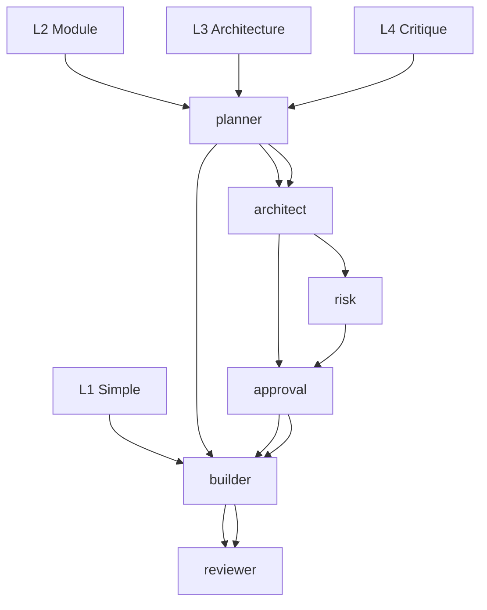
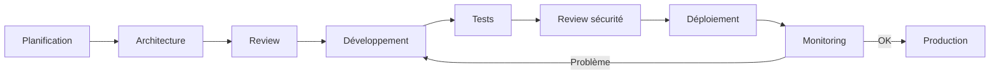

# Documentation des Skills — opencode-config EURINHASH

## Table des matières
1. [hash-agent-matrix](#hash-agent-matrix)
2. [hash-token-efficiency](#hash-token-efficiency)
3. [hash-code-navigation](#hash-code-navigation)
4. [hash-verification](#hash-verification)
5. [hash-enterprise-development](#hash-enterprise-development)
6. [Créer une nouvelle skill](#créer-une-nouvelle-skill)

---

## 1. hash-agent-matrix — Routage des tâches L1-L4

### Description
Skill qui définit le routage intelligent des tâches selon leur complexité (niveaux L1 à L4). Détermine quel agent/pipline utiliser.

### Niveaux de complexité

| Niveau | Description | Exemples | Pipeline |
|--------|-------------|----------|----------|
| **L1** | Typo, color, config, bug localisé | "Corrige la typo 'teh' en 'the'", "Change la couleur en #FF0000" | `@builder` (direct) |
| **L2** | Module, endpoint, business logic | "Ajoute l'authentification OAuth", "Crée l'API utilisateur" | `@planner` → `@builder` |
| **L3** | Nouveau module, architecture, API change | "Refactor en microservices", "Nouveau système de paiement" | `@planner` → `@architect` → `approval` → `@builder` → `@reviewer` |
| **L4** | Critique : production, données sensibles | "Migration données clients vers nouvelle BD", "Chiffrement des mots de passe" | `@planner` → `@architect` → `risk assessment` → `approval` → `@builder` → `@reviewer` |

### Pipeline par niveau



### Routage automatique dans OpenCode

```bash
# L1 - Direct
opencode /run "Corrige la typo"

# L2 - Planification d'abord
/agent planner "Planifie l'auth"
/agent builder "Implémente l'auth"

# L3 - Architecture + approval requis
/agent architect "Décide de l'architecture du module auth"
# Après approval de l'utilisateur :
/agent builder "Implémente selon l'architecture validée"

# L4 - Architecture + risk + approval
/agent architect "Évalue les risques de la migration de données"
# Après risk assessment et approval :
/agent builder "Migre les données"
```

### Configuration
La matrix est définie dans `skills/hash-agent-matrix/SKILL.md` :
```markdown
# Routage L1-L4

## Niveaux
- L1 : ...
- L2 : ...
- L3 : ...
- L4 : ...

## Pipeline
- L1 → @builder
- L2 → @planner → @builder
- L3 → @planner → @architect → approval → @builder → @reviewer
- L4 → @planner → @architect → risk → approval → @builder → @reviewer
```

### Détection du niveau
Le système détecte automatiquement le niveau via :
1. Mots-clés (typo → L1, ajoute → L2, refactor → L3, migration → L4)
2. Nombre de fichiers impliqués
3. Impact sur l'architecture
4. Sensibilité des données

### Définir un nouveau niveau
```bash
# Modifier skills/hash-agent-matrix/SKILL.md
# Ajouter la définition et le pipeline
```

---

## 2. hash-token-efficiency — Optimisation des tokens

### Description
Skill qui optimise l'utilisation des tokens pendant les interactions avec les providers AI. Réduit les coûts et améliore les performances.

### Techniques d'optimisation

#### 1. Contexte compressé
- Résumé automatique quand >80% de la fenêtre de contexte
- Conservation des décisions clés et des fichiers modifiés
- Suppression des redondances

#### 2. Prompts succincts
- Instructions directes sans contexte inutile
- Utilisation de listes à puces au lieu de paragraphes
- Définition des variables en amont

#### 3. Cache de réponses
- Mise en cache des réponses récurrentes
- Rejoue le même prompt au lieu d'appeler le provider
- Stockage dans `~/.config/opencode/` localement

#### 4. Coupage intelligent
- Découpage des gros fichiers en parties gérables
- Analyse de chaque partie séparément
- Synthèse des résultats

### Métriques de suivi
- Tokens utilisés par tâche
- Tokens économisés par optimisation
- Coût par tâche (si provider payant)
- Latence réduite

### Utilisation
```bash
# L'optimisation est automatique via EURINHASH
# Mais on peut forcer certaines techniques

# Voir les métriques
/quota --detail

# Voir l'état des tokens
/scripts/hash-direct.py --status
```

### Exemple d'optimisation
```bash
# Sans optimisation (long, coûteux)
/run "Explique le pattern en détail sur 500 mots..."

# Avec optimisation (court, efficace)
/run --task-type code --max-tokens 500 "Explique le pattern de factory method en 3 parties"
```

---

## 3. hash-code-navigation — Navigation efficace dans le code

### Description
Skill qui aide à naviguer efficacement dans de gros codebases. Recherche, localisation, extrait de code.

### Capacités

#### 1. Recherche de symboles
```bash
# Chercher une fonction
/run "Trouve la fonction calculate_total dans le codebase"

# Chercher une classe
/run "Trouve la classe UserRepository"
```

#### 2. Localisation de patterns
```bash
# Chercher un pattern
/run "Trouve toutes les requêtes SQL non paramétrées"

/run "Trouve les mots de passe en dur dans le code"
```

#### 3. Extraction d'extraits
```bash
# Extraire une fonction
/run "Extrait la fonction validateInput et renvoie juste le code"

/run "Montre-moi les 10 premières lignes de la fonction handleSubmit"
```

#### 4. Fichiers liés
```bash
# Trouver les fichiers liés
/run "Quels fichiers appellent la fonction processOrder ?"
```

### Utilisation
```bash
# Navigation de base
/run "Où est définie la fonction authenticateUser ?"

# Recherche avancée
/run "Cherche tous les points de terminaison API non documentés"

/# Navigation dans un fichier spécifique
/run --focus src/api/routes.ts "Où est la route pour /users ?"
```

### Intégration avec les agents
- `@builder` : Pour modifications de code
- `@reviewer` : Pour analyse de patterns
- `@security` : Pour recherche de vulnérabilités
- `@git-engineer` : Pour histoire du code

---

## 3. hash-verification — Vérification proportionnée

### Description
Skill qui définit le niveau de vérification requis selon la criticité de la tâche. Équilibre entre sécurité et rapidité.

### Niveaux de vérification

| Niveau | Criticité | Vérification | Temps |
|--------|----------|--------------|-------|
| **V1** | Routine, faible risque | Vérification rapide | ~2 min |
| **V2** | Moyen risque | Vérification complète | ~10 min |
| **V3** | Élevé, production | Vérification approfondie | ~30 min |
| **V4** | Critique, données sensibles | Audit complet | ~1h+ |

### Critères de niveau

| Niveau | Critères |
|--------|----------|
| **V1** | Bug fix, typo, config, documentation |
| **V2** | Nouvelle feature, refactoring, tests |
| **V3** | Architecture changement, sécurité, déploiement |
| **V4** | Données sensibles, conformité, production |

### Procédure par niveau

#### V1 - Vérification rapide
```bash
# Auto via EURINHASH
/run "Corrige la typo"

# Manuellement
/scripts/hash-direct.py "test"
```

#### V2 - Vérification complète
```bash
# Vérifier la qualité
/quality-engineer "Vérifie ce code"

# Vérifier les tests
/tester "Écrit les tests"

/# Revue de code
/review
```

#### V3 - Vérification approfondie
```bash
# Analyse sécurité
/security "Audit complet ce module"

/# Revue architecturale
/architect "Décision architecture"

/# Tests étendus
/tester "Couverture complète"
```

#### V4 - Audit complet
```bash
# Audit de sécurité complet
/security "Audit production"

# Conformité
/commit "avec audit security"

# Validation manuelle requise
# Utilisateur doit valider avant déploiement
```

### Recommandation
- **Tâches quotidiennes** : V1 ou V2
- **Nouvelles features** : V2
- **Modifications production** : V3
- **Données sensibles** : V4 (avec approval utilisateur)

### Définir le niveau
Le niveau par défaut est V1 pour les agents EURINHASH. Peut être forcé :
```bash
/run --verification-level V3 "Modification importante"
```

---

## 4. hash-enterprise-development — Développement enterprise

### Description
Skill pour les projets enterprise avec exigences spécifiques : conformité, audit, multi-équipes, déploiement continu.

### Domaines couverts

#### 1. Conformité et réglementation
- RGPD, HIPAA, SOC 2
- Conservation des données, droit à l'oubli
- Journalisation des accès, traçabilité

#### 2. Architecture enterprise
- Microservices, service mesh
- Patterns CQRS, Event Sourcing
- API Gateway, rate limiting
- Circuit breaker patterns

#### 3. Déploiement continu
- GitOps, ArgoCD
- Canary releases, blue-green
- Infrastructure as Code (Terraform)
- Monitoring et alerting

#### 4. Sécurité renforcée
- Zero trust
- Chiffrement des données au repos
- Gestion des secrets (Vault, AWS KMS)
- Auditing complet

### Workflow enterprise



### Bonnes pratiques enterprise

1. **Documentation systématique** : Chaque changement documenté
2. **Revues obligatoires** : Toujours @reviewer + @security
3. **Tests de couverture** : ≥ 80% exigé
4. **Journalisation** : Tous les événements critiques
5. **Rollback plan** : Toujours avoir un plan de retour en arrière
6. **Approval multi-équipes** : Pour les changements critiques

### Utilisation avec EURINHASH
```bash
# Pour les tâches enterprise
/agent architect "Concevoir l'architecture microservices"
/agent reviewer "Reviewer la PR avec checklist enterprise"
/agent security "Audit de conformité RGPD"

/# Avec niveau de vérification V4
/verify --level V4 "Modification critique"
```

### Configuration
La skill est définie dans `skills/hash-enterprise-development/SKILL.md` avec :
- Checklists de conformité
- Workflows d'approbation
- Checklists de sécurité
- Métriques de déploiement

---

## 5. Créer une nouvelle skill

### Structure de base
```markdown
# Nom de la skill

## Description
Description détaillée de la skill...

## Activation
Quand utiliser cette skill :
- Condition 1
- Condition 2

## Workflow
1. Étape 1 : Description
2. Étape 2 : Description
3. Étape 3 : Description

## Validation
Comment valider le résultat :
- Critère 1
- Critère 2

## Configuration
Options de configuration :
- Option 1 : Valeur par défaut
- Option 2 : Autre valeur

## Exemples
### Exemple 1 : Usage de base
```bash
/skill "Usage de base"
```

### Exemple 2 : Usage avancé
```bash
/skill --option "Valeur avancée"
```
```

### Création pas à pas

```bash
# 1. Créer le répertoire
mkdir -p skills/ma-skill

# 2. Créer le fichier SKILL.md
cat > skills/ma-skill/SKILL.md << 'EOF'
# Ma Skill

## Description
Description de ma skill...

## Activation
Quand l'utiliser :
- Situation 1
- Situation 2

## Workflow
1. Première étape : Que fait-elle ?
2. Deuxième étape : Que fait-elle ?
3. Troisième étape : Que fait-elle ?

## Exemples
### Usage de base
```bash
/ma-skill "Prompt de base"
```

### Usage avancé
```bash
/ma-skill --option "Valeur spéciale" "Prompt avancé"
```
EOF

# 3. La skill est disponible
# 4. Pour qu'elle apparaisse dans le routing, l'ajouter dans hash-agent-matrix
```

### Bonnes pratiques

1. **Documentation claire** : Chaque étape expliquée
2. **Exemples concrets** : Cas d'usage réels
3. **Validation définie** : Comment savoir que ça marche
4. **Non-régression** : Ne pas casser les workflows existants
5. **Maintenance** : Mise à jour quand nécessaire

### Intégration avec le système

```bash
# 1. La skill apparaît dans /help
/ma-skill "test"

# 2. Peut être invoquée par les agents
/agent builder "/ma-skill "Prompt"

# 2. Peut être utilisée dans le routing L2-L4
# Modifier hash-agent-matrix si nécessaire
```

---

*Documentation skills générée le $(date)*